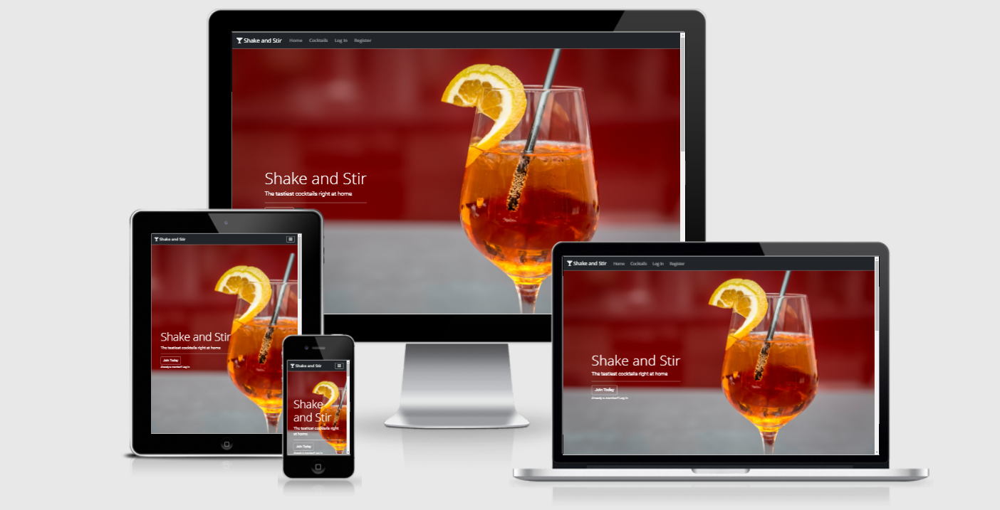

# Shake n Stir - Cocktails right at home

Shake and Stir is a community-focused cocktail recipe app. This app aims to promote, discover and share different cocktail recipes.

[You can view the live project here](https://shake-and-stir.herokuapp.com/)



## Overview

A website for people who wish to discover, create and share their favorite cocktail recipes.

The website features a register and login form, to allow users to create their profile. Once a user has created their profile, they can create, edit and delete their cocktail recipes. The website also features a landing page, a cocktail collection page, as well as individual cocktail pages. The main goal of this website is to promote the art and joy of making cocktails, while also allowing others to discover unknown cocktail recipes.

The website is built with CRUD functionality and maintains responsiveness across all main devices; desktop, tablet, and mobile.

## User Stories

* I want a website that allows me to create my cocktail recipes.
* I want a website where I can view other people's cocktail recipes. 
* I want the ability to search for cocktails on the website. 
* I want a website that is easily accessed on my mobile phone and tablet. 
* I want a website that is easy to understand and navigate.
* I want to have a profile to store my created cocktails. 
* I want to be able to edit or delete my created cocktail recipes.
* I want my profile to be password protected.
* I would like to be able to follow the website's social media accounts.

## Project Goals

* I want to promote the creative experience of making cocktails.
* I want to allow users to create, edit and delete their cocktail recipes. 
* I want to grow the website's social media presence. 
* I want users to be able to create their profiles.
* I want users to understand and navigate the website upon their first visit. 
* I want users to be able to search for different cocktails.
* I want to store a user's submitted cocktail in my Database. 
* I want users to be able to upload a photo of their cocktail. 


## UX 

The practice of making a cocktail is a creative process, mysterious, and full of trial and error. I created this website to help develop an online community where people can create and share their favorite cocktail recipes. I always believed that taste is subjective, and many people have different preferences when it comes to a 'perfect' cocktail. As a result, I wanted to create a space for all cocktails, free of arbitrary ratings and conventional recipes. 

## Strategy 

The goal of this website is to support and encourage the cocktail-making community. The website was built to provide a platform for users to share cocktail recipes. The secondary goal of this website is to promote Stir n Shake's social media following and to provide a place where people can discover cocktails they never knew about before. This allows for a sense of community, and continuous growth for the website.

### Business Goals: 

* Highlight and encourage cocktail making.
* A simple and easy to navigate website with a clear purpose.
* Mobile-first design to increase ease of use for those without PCs.
* Increase web presence to grow the brand and discover unique cocktail recipes.

### User Goals: 

* Looking for ideas on what cocktail to make.
* Clear and informative steps on how to make a specific cocktail.
* A profile to save, and upload my cocktail recipes.
* Mobile-friendly website as the majority of users browses via mobile. 
* An easy-to-understand and navigate website. 
* A website that allows me to search for different cocktails depending on spirit type.
* A password-protected profile.
* To follow the website's social media accounts.  

## Scope 

The Scope and features of this project were based on personal experiences throughout the last year. As many bars and restaurants closed for long periods, I had missed the experience of trying new cocktails.

Taste is subjective, and my favorite part of trying new cocktails, are the creative spins people can employ when making their version of a popular cocktail. For this reason, I wanted to create a cocktail recipe community, that allowed anyone to make an account, and share their recipe. 

I decided to forego a common feature; ratings. In addition, I wanted the focus to be on people's cocktail recipes, and so I decided to keep the home page short and to the point. I also used several call-to-action buttons to help users quickly create an account and start making cocktails. 

## Structure 


My goal was to provide users with a simple and easy-to-navigate interface and experience. I want users to enter the site, and feel confident in navigating throughout the various pages. 

The home page features a large colorful image, and a call to action button for users to join the website or to log into their account. This button changes if a user is already logged into their account, and will instead encourage users to browse the collection of cocktails. The home page provides users with an introduction website's philosophy. At the bottom of the home page, users are presented with three cocktail cards to encourage users to make a cocktail or browse more cocktails. I have also created a footer with a basic site map, social media links, and a search bar to quickly search for cocktails. 

As there are over 10 different pages for this website, I have provided a summary of the most notable aspects in the 'Features' section below.


## Skeleton 

All wireframes were created using Balsamiq. The main product of the website has changed from the initial wireframe. Although the wireframes provided an outline, I made some creative choices throughout the development cycle. I have outlined some of the major changes below. 

1. The biggest creative difference between the initial wireframe designs and the final product, is the removal of the FAQ page. I felt that the information provided on the Home page was sufficient for users to understand the website's purpose. 
2. While developing the website, I felt the need to create Admin-only pages to manage categories. This resulted in a seamless way to update, edit and create Cocktail categories. 
3. I decided to omit a checkbox search feature, and instead implement a text search feature. The reason for this was because I felt it was a better UX to search for specific cocktails and cocktail categories, rather than using a more limiting checkbox system.
4. I decided to create two cocktail pages. One cocktail page to display all cocktails on the website, and a cocktail page that displays the instruction, ingredients, etc of individual cocktails. 

The wireframes of each page and their respective devices are linked below.

- Note: To open links in a new tab please use CTRL+click (on Windows and Linux) or CMD+click (on macOS).

### Wireframes  

* [Home Page Desktop](./docs/wireframes/home-page-desktop.png)
* [Home Page Tablet](./docs/wireframes/home-page-tablet.png)
* [Home Page Mobile](./docs/wireframes/home-page-mobile.png)

* [Recipe Page Desktop](./docs/wireframes/recipes-page-desktop.png)
* [Recipe Page Tablet](./docs/wireframes/recipes-page-tablet.png)
* [Recipe Page Mobile](./docs/wireframes/recipes-page-mobile.png)

* [User Profile Page Desktop](./docs/wireframes/user-profile-desktop.png)
* [User Profile Page Tablet](./docs/wireframes/user-profile-tablet.png)
* [User Profile Page Mobile](./docs/wireframes/user-profile-mobile.png)

* [FAQ Page Desktop](./docs/wireframes/faq-page-desktop.png)
* [FAQ Page Tablet](./docs/wireframes/faq-page-tablet.png)
* [FAQ Page Mobile](./docs/wireframes/faq-page-mobile.png)

## Surface 

### Images

There are two ways in which images are used throughout this app;  Static and Dynamic images. 

Images that do not change are in the 'static' folder. I have stored the landing page images here, as they are fixed and will not be changed. I decided to use a bright photo of a cocktail, which clearly shows the user that the website is about cocktails. The second static image I have used is a collection of cocktails with a variety of colors while also maintaining dark tones in the background of the image.

I consider the images that users uploaded to be 'dynamic' as they are subject to change. The dynamic images are handled through Cloudinary. I have decided to use the Cloudinary Widget API, as I felt it offered a good UX and allowed a seamless way of utilizing images that are not stored as a static file. By using Cloudinary, images avoid the risk of being removed on Heroku once deployed. 

### Colours

One of the challenges of styling the front-end of this website was that users can upload images of their cocktails. This adds a lot of variables when choosing the website colors. A cocktail can be bright in color, or it can also be a dark-colored cocktail. The background colors of a user's uploaded image can also impact the website's overall feel and tone. 

It was necessary to use neutral colors throughout the website to avoid jarring color clashes. For this reason, I choose a bright orange with dark red tones image of a cocktail for the home page image. I also choose this image as it had a dark-colored straw. 

I decided to match the navigation bar, footer, text, and majority of buttons to the color of the straw in this photo. The color I felt closely matched this was #212529: a very dark, almost black, blue. This results in a subtle symmetry that's established once a user enters the website. Users from the home page will feel accustomed to seeing a bright image complemented with darker colors. 

The background color of the website alternatives between two shades of white (#f7f7f7 and #f1f1ef). I felt these maintained their neutrality whether the image was bright, dark, or in between. 

The navigation buttons used throughout the website were Bootstrap's "outline-dark" and "outline-light". The hover state of these buttons match the color of the navigation bar and footer and created a consistent flow to the website.  

The minimal use of background colors, and color shifts with the footer, text, buttons, and navigation bar helped to create a consistent feel. This was especially important due to the unpredictable changes that can occur due to a user's uploaded cocktail card, and image. 

### Font 

I decided to use two fonts for the website. I chose the font 'Open Sans' for the navigation links, footer links, and all headings. I felt this font was extremely readable, and simple. For the remainder of the text, I chose to use the font 'Roboto'.  I felt this font was easy to read and paired well with Open Sans.

It was important to not use an unconventional font, which could be distracting, as there are already quite a lot of color differences due to the ability of users to upload their images. 


### Icons

I felt it was important to use icons throughout the website as it helped to separate chunks of information, and exhibit a welcoming feeling, particularly in the cocktail recipe section, and the cocktail forms.

Icons are utilized throughout the cocktail cards, and cocktail recipes to help identify each piece of information. In addition, I chose to place a trash bin icon beside the delete button within the delete modals, to re-instate the finality of deleting a piece of information. 

Finally, the use of Social Media icons helps to remove unnecessary text, as a Facebook icon is used to represent the website's Facebook, etc. 

## FEATURES

Throughout the website, I have had added defensive measures to prevent unauthorized access to pages. For instance, a user cannot edit a cocktail created by another user, and a user without an account is unable to create a cocktail. These measures are present on most pages, and offer a secure experience for those who create a profile, and cocktails.

### Current Features 

#### The Navigation Bar

The navbar items vary depending on whether a user has created an account or not, and also whether the account is an admin or not.When a new user arrives at the website they will see four items: 

- Home,
- Cocktails,
- Log In, 
- Register. 

When a user is logged in they will see:

- Home,
- Cocktails, 
- Add Cocktail 

In addition, a profile button will appear on the right-hand side of the navigation bar. The profile button when clicked reveals a dropdown menu, which has more navigation links:

- Profile 
- Add Cocktail 
- Log Out. 


Finally, if a user who logs in is an Admin, then they will see one more navigation link, namely; Categories. This is where they can add, edit, and delete cocktail categories such as Gin, Vermouth, Rum, etc. 

#### The Footer Section 

Each page contains a footer, which has a basic site map consisting of 
Home, Cocktails (Login and Register for non-account users) and (Add Cocktail, and Profile for Logged in users). 

The footer features a search bar, to allow users to quickly search for a cocktail. When a user searches for a cocktail they are directed to the cocktails.html page and shown the relevant results. The footer also contains social media links for the website's social media accounts. 

#### Register and Log In Pages

##### Register Page

The Register Page consists of a simple form where a user can input a username and password. To help with creating an account, I have inserted both a password field and a confirm password field. To ensure that a user is unable to create an account if their passwords do not match, I have added visual cues via jQuery/Bootstrap validation classes to change the input fields to red and display feedback to the user, to help them create an account. In addition, with the help of Python, I have prevented access from posting the form to the database if the password fields do not match.

Finally, I have a link to the log-in page, just in case a user already has an account. 

##### Log In Page

The login page features a simple form, where a user inputs their username and password. If a user inputs an incorrect username or password, they are prevented from logging in. I have also created a flash message which informs the user that their attempt to log in was unsuccessful, while also maintaining a defensive programming stance and not indicating which specific field has failed validation. 

Finally, I have a link to the register page, just in case a user has not yet created an account. 

#### Profile Page

The Profile Page features a card with a personalized 'Welcome' heading using Jinja and the session user's username. For quick access, the profile card also features two buttons; Add Cocktail which links to the Add Cocktail Form, and browse Cocktails, which links to the Cocktails.html page. 

Beneath the profile card, I chose to place the cocktails a user has created, for quick management. Here a user can see which cocktails they created, as well as buttons to either Edit or Delete their cocktail. When a user clicks to delete their created cocktail, a modal is triggered which asks the user to confirm whether they want to delete the cocktail or not. 

At the bottom of each profile page, a user is shown two more buttons; Log out, and Delete Profile. If a user clicks Log Out they are removed from the current session and redirected to the login page. If a user clicks the Delete Account button, a modal is triggered and asks the user to confirm whether they want to delete their account. If yes, the account is removed, and the user is redirected to the home page. 

#### Add Cocktail page

The Add Cocktail page features a BootStrap form. Each field is accompanied by Font Awesome Icons to help style an otherwise simple page. I have added placeholder text with instructions for the user to assist in filling out the form. Finally, I have given users the option of directly inputting an image URL for their cocktail image, or the option to upload from their files. The images are stored in Cloudinary, and the image input button initializes the Cloudinary widget. I have appended the button to the file input to keep the form layout consistent. 

#### The Edit Cocktail 

The Edit Cocktail page is the same as the Add Cocktail Page, except for a few layout differences. 

First, the value of the cocktail remains in the appropriate fields, and a thumbnail of the user's inputted image is displayed. If a user decides to change their cocktail image, the thumbnail is updated accordingly. Finally, there is an option for the user to cancel their edit, and revert the changes, there is an option to update their edited cocktail, and to delete their cocktail. Like all deleted actions, users are first presented with a modal to confirm their choice. 

#### Cocktail Collection Page

To display the collection of cocktail recipes, I decided to use Bootstrap's cards. I styled these cards to place the user image on top, and place a small amount of information beneath the image. This layout gave a clean, and professional feel, while also giving the other cards space to breathe. Within the body of the card, I decided to omit a short description, as I felt with more and more cocktail cards being added, it could become overwhelming. Therefore, I used Font Awesome icons and labeled each cocktail card with a category: rum, gin, whiskey, etc as well as the servings: 1, 2, etc and who created the cocktail. 

I have also placed a very subtle shadow effect when hovering over the cards, to indicate to the user which card is currently selected. I have also added a 'View' button that redirects the user to that specific cocktail page, as well as an anchor tag on the title of the cocktail card which also redirects the user to the specific cocktail page when clicked. When a user clicks on a cocktail card, they are redirected to the cocktail recipe page, where ingredients, and instructions are outlined. This allows the user to control which cocktail recipes they wish to view and allows quick navigation between different cocktail recipes. 

#### Category Page

The Category page which is only accessible through an admin account features a simple list of all current categories with small action buttons beside each one; edit and delete. Clicking on the edit button, redirects to the 'Edit Category Form' and clicking on the delete button, triggers a confirmation modal to delete the category. I tried to keep the information and structure as simple and concise as possible. This was a decision choice. The goal was to find a balance, as these pages are highly text-based, and can easily look overwhelming, cluttered. 

#### Search Functionality 

Users can search for cocktail names and cocktail categories. If a user searches for 'Whiskey' all cocktails with the category of whiskey are returned. If there are no results returned, the page displays a list of popular cocktails. I chose to use a list, as cocktail cards were already used on the index page, and the cocktails.html page. I felt a list offered concise information and a visual change.

#### 404 Page

If a user finds themselves with a broken link or a page that doesn't exist, they are presented with a 404.html page. This page features a title, and some text to explain what has happened. It also features a button to redirect users to the home page. This creates a better experience for all users, so they do not have to use the browser to navigate.

#### 500 Error Page

If an internal server error occurs, users are presented with a 500.html page. This page has the same features as the 404 page, except with a different title and text to inform the users about the specific error that has occurred.

### Future Features 

1. In the future, I would like to deepen the search parameters, so when a user searches for lime, all the cocktails with lime garnish will populate. 

2. I would like to add an option for users to save their favorite cocktails to their profile. 

3. I would like to introuduce sub classes for cocktails. For example, for each Martini recipe, they are sub-classes which link to French Martini, Dry Martini etc. 

4. Finally, in the future, I would also like to introduce more admin accounts, to help manage the website. 

## Database Information. 

I used a NoSQL Database, namely MongoDB for this project. MongoDB was used to store category, cocktail, and user information. I tried to keep the information as concise as possible, and where possible link data to one another. For instance, each cocktail has a created_by which links to the id of a user. Each cocktail also has a category, which links to the category's 'category_name' value.

I have created a database wireframe using dbdiagram. This can be seen [here](./docs/wireframes/database-wireframe.png)

The full database can be viewed in the 'Deployment' section of this README.

## Troubleshooting

I experienced several issues in different stages of development. Often these issues were part of a major feature, and so I have divided the troubleshooting section accordingly. 

### Register Form

1. The first issue I had, was not being able to register any users. Upon inspection, I had not used quotes for the request.form.get("password") as a result there was a NoneType Error. This was quickly fixed by adding the necessary quotation marks.  

2. Upon reading Bootstrap's documentation, I decided to use Bootstrap's script to prevent form submission when fields are incorrect. This can be found [here](https://getbootstrap.com/docs/4.6/components/forms/#validation)

3. It was important for me to have two password fields; a password field and a confirm password field. I wanted the form to not allow submission unless both password fields match. I found a solution on Stack Overflow which allowed me to create a custom validity for the form on input. This was an acceptable solution. The solution can be found [here](https://stackoverflow.com/questions/49943610/can-i-check-password-confirmation-in-bootstrap-4-with-default-validation-options) the code used was:
```
"oninput='confirm_password.setCustomValidity(
                    confirm_password.value != password.value ? "Passwords do not match." : "")'"
```

4. In addition to the above, I have also added some custom jQuery code to add is-valid, and is-invalid classes depending on if the password fields matched or not. This served mainly as a way of immediately providing visual cues to the user regarding the password match. I found a solution on Stack Overflow, which fitted my needs.
	1. I changed the code to fit my needs by adding and removing bootstrap classes for visual cues, as well as validation purposes. I also wanted the visual cues to be instantly shown to the user while they typed in the password fields. For this, I used the keyup function. The solution for this code was found [here](https://stackoverflow.com/questions/9717588/checking-password-match-while-typing)
	
5. I experienced an issue when attempting to register as a user who uses an uppercase letter in their password. I was unsure why this was failing, however upon inspection, I realized that in my Python file, I had a condition to store the user's password as lowercase. Therefore when trying to log in again, the password would not be accepted unless it was in lowercase.
	1. The solution to this was either to remove the .lower() method for user passwords, or to add this condition to the login password function. I felt it was not good defensive programming if a user could not strengthen their password by using uppercase, so I decided to remove the .lower() method for passwords. 


### User's Uploading Images

1. I experienced an issue trying to figure out a streamlined way to allow users to upload their cocktail images, and how to store these images. This was tricky for me as the images could not be stored on Heroku. I decided to use Cloudinary, a web service that allowed me to store uploaded images.
	* I initially set up Cloudinary through Flask and updated Heroku to include the API Environment variable that Cloudinary provides. The issue arose when I wanted users to be able to upload the image in several ways. When using the Cloudinary API through Flask, users had the option of uploading an image directly from their computer/phone. If they found an image on a website, they would first have to download the image to their device and then upload it on Shake and Stir's website in the 'Add Cocktail' form. This was not an optimal workflow, however, at the moment I felt it was acceptable. 
		* Another issue was presented when users wanted to edit their submitted cocktails, the previous image would not be remembered. As a result, if a user wanted to edit their cocktail name or description, they would also have to either a) re-upload the previous image, or b) upload a new image. I did not feel that this was a good user experience, and instead, I chose to employ a more user-friendly method of storing the image as a string rather than a file and using Cloudinary JavaScript Widget. This enabled the user when editing a cocktail, to keep the same image they previously uploaded, or to upload a new image. In addition, it also gave the user the option of pasting an image URL directly into the form field. 
		* I found assistance to integrate the widget on Code Institute's Slack which can be viewed [here](https://code-institute-room.slack.com/archives/C7JQY2RHC/p1617045169343600?thread_ts=1615584706.280600&cid=C7JQY2RHC)
		* I also used Cloudinary's official documentation, which can be seen [here](https://cloudinary.com/documentation/upload_widget)

2. I experienced an issue when allowing users to edit their cocktail, specifically their cocktail image. If a user clicked on the 'Upload Image' button, there was already a URL in the input box (the previously uploaded image), the form would automatically resubmit. To work around this, a user would first have to delete the value inside the input prior before attempting to initialize the widget to select a new image. 
	* I felt this was not a good user experience, and I added some jQuery to clear the value of the input box if a user clicked on the 'Upload Image' button. This prevented the form from being submitted and allowed the user to submit a new image without first manually deleting the previous string. 


### General Troubleshooting

1. I wanted to display some cocktail recipes on the index.html, however, I was faced with an issue of all cocktails showing on the home page. I wanted to display a select few; 3-6 cocktails. Upon further research, I discovered the limit() method. This was found [here](https://www.w3resource.com/mongodb/mongodb-skip-limit.php#:~:text=The%20limit()%20function%20in,()%20can%20do%20this%20job.) 
	```
	db.userdetails.find().limit(2);
	```
	From here, I changed the code to suit my needs, 


2. I experienced an issue when trying to enable a feature that allows users to preview the image currently being used when utilizing the 'Edit Cocktail' form. I found a solution on Stack Overflow which can be seen [here](https://stackoverflow.com/questions/20820705/render-preview-image-from-url-input)


3. I experienced an issue when trying to target the correct Cocktail Recipe via Delete Modal. The modal was not selecting the intended recipe. I printed the value of the modal and quickly saw that it was targetting the earliest entry. Researching this issue, I found a discussion on Code Institute's Slack channel. 

	To solve this issue, I added a {{ loop.index }} to the modal ID. This allowed the modal to loop through IDs, and correctly target the intended cocktail. 

	The discussion which led to this solution can be seen [here](https://code-institute-room.slack.com/archives/C7JQY2RHC/p1619951407137000?thread_ts=1619950530.136800&cid=C7JQY2RHC)


4. When creating the input for Cocktail Servings, I wanted to implement a regex pattern, and I found a solution on Stack Overflow which allowed me to further understand the syntax of Regular Expressions. The solution can be view [here](https://stackoverflow.com/questions/32435949/regex-to-allow-only-number-between-1-to-12)
	* The link provides a longer expression with different conditions, however, I customized the expression to fit my needs:  ``` ^([1-9])$ ```

5. A hurdle I encountered when trying to display a user's cocktail information was how to effectively organize the Ingredients and Instructions section of a recipe. Generally, these are displayed as lists, and I was unsure how to replicate this from the 'Add Cocktail' form. I decided to use the Python splitlines.() method. This allowed me to display the instructions/ingredients in an easily readable way. I found this method [here](https://www.w3schools.com/python/ref_string_splitlines.asp) 

6. I experienced an issue when trying to display all created cocktails in a structure card layout. I initially, placed a for loop after Bootstrap's col class. This resulted in the cocktail cards just occupying one side of the screen. Since I placed the loop after the column was placed, each iteration continued to add to a single column. 

	I resolved this issue by placing the for loop outside of the column declaration. 


## Known Issues 

There is one known issue with this project.

A warning appears on the deployed Heroku version of the website.

```
rollbar.min.js:1 env-config Cannot read environment override from local storage
```

 This warning relates to the Cloudinary widget, as when searching for 'rollbar.min.js' within my files, it doesn't exist. I have searched extensively for a solution for this warning, and I was unable to find one. However, upon speaking with Code Institute's Tutor support, it seems the issue is with Cloudinary. As a result, at least for now, I have to ignore this warning. 


## Technologies Used

* This website was developed using [HTML5](https://en.wikipedia.org/wiki/HTML5), [CSS3](https://en.wikipedia.org/wiki/CSS), [JavaScript](https://en.wikipedia.org/wiki/JavaScript) , and [Python](https://en.wikipedia.org/wiki/Python_(programming_language))
* [Flask](https://flask.palletsprojects.com/en/2.0.x/) to render pages and avoid repeated code. 
* [jQuery](https://jquery.com/) was used to simplify JavaScript code.
* [Jinja](https://jinja.palletsprojects.com/en/3.0.x/) was the templating language used to easily communicate backend logic to the front-end.
* [Werkzeug](https://werkzeug.palletsprojects.com/en/2.0.x/) was used to help enforce defensive programming measures.
* [PyMongo](https://pypi.org/project/pymongo/) which allows Python to communicate with MongoDB.
* [MongoDB](https://www.mongodb.com/) was the Database used in this project.
* The fonts used in this website were imported from [Google Fonts](https://fonts.google.com/). 
* I used [Font Awesome](https://fontawesome.com/) for all icons.
I used [Unsplash](https://unsplash.com/) to source images used on the website.
* [Bootstrap](https://getbootstrap.com/) was used to structure the layout of the website and maintaining layout and responsiveness to tablet and mobile devices. I linked Bootstrap to the HTML document via [CDN](https://www.bootstrapcdn.com/).
* [Cloudinary](https://cloudinary.com/) was used to store user uploaded images. 
* This website was initially designed with wireframes using [Balsamiq](https://balsamiq.com/). 
* [Git](https://git-scm.com/) version control was used to store the version of files and track the development progress. 
* The IDE used to work on this project was [Gitpod](https://www.gitpod.io/). 
* [Github](https://github.com/) was used to manage Git repositories.
* [Heroku](https://www.heroku.com/) was used to deploy the website.
* HTML code was validated with [W3C](https://validator.w3.org/). 
* [W3C CSS](https://jigsaw.w3.org/css-validator/) was used to check the validity of the CSS code in this project. 
* [Jshint](https://jshint.com/) was used to test the validity of JavaScript code. 
* [PEP8Online](http://pep8online.com/) was used to check Python code to ensure it met PEP8 requirements.
* [Google Lighthouse](https://developers.google.com/web/tools/lighthouse#devtools) was used to check that the website is user-friendly.
* [Google Mobile-Friendly Test](https://search.google.com/test/mobile-friendly) to test the website on mobiles. 
* [Favicon.io](https://favicon.io/) was used for the website's favicon.
* [ResponsiveDesign](http://ami.responsivedesign.is/) was used to display the README's Overview Image.

## Testing

The documentation for testing this website is located in another file. This can be viewed [here](./docs/testing/testing.md). 

Note: To open links in a new tab, please use CTRL+click (on Windows and Linux) or CMD+click (on macOS).


## Deployment

Before attempting to deploy this website on Heroku, I first created my Database on MongoDB. I have outlined the steps taken below: 

1. Create an Atlas Account on MongoDB.
2. Deploy a Free Tier Cluster. 
3. Click on the Collections button.
4. Click 'Create Database'
5. Name your Database.
6. Create an initial collection, I chose to create one called 'categories', and click on the create button.
7. For my project, I created three collections: 
	* 'Categories'
	* 'Cocktails'
	* 'Users'
8. Click on one of your created collections, and click 'Insert Document'. This is where the information is stored. For example, in the 'Categories' collection, I insert a document with the following information: 
	* "category_name: Rum"
9. You can decide to manually add the remaining information for this document, or insert more information later with Python. I chose to populate the remaining information with Python. 
10. To continue to create your Database manually, repeat steps 6-8 as needed.

The database I have created for this project is as follows: 

| Users | type|   	
|---	|---	
|_id  	| ObjectId ('User ID') |   
|username | "string" |   	  
|password | "string" |  


| Categories | type|   	
|---	|---	
|_id  	| ObjectId ('Category ID') |   
|category_name | "string" |


| Cocktails | type|   	
|---	|---	
|_id  	| ObjectId ('cocktail ID') |   
|category_name | "string" |
|cocktail_name 	| "string" |   
|cocktail_description | "string" |
|cocktail_ingredients | "string" |
|cocktail_instructions 	| "string" |
|cocktail_serving | "string" |
|created_by | "string" |
|cocktail_img | "string" |


### Heroku Deployment 

It's important to ensure that the Requirements.txt file is up to date with the resources used in the project. 

In my terminal, I typed 'pip3 freeze --local > requirements.txt'. I then pushed the changes to Github.

The next set was to set up the Procfile. I went to the terminal and typed 'echo web: python app.py > Procfile.'

Following the advice from Tim Nelson, in Code Institute's Task Manager project, I ensured that there was not an empty line in the Procfile, as it can cause issues with Heroku.

I then pushed the changes to Github.

The next step was to set up Heroku. 
1. Create an account on Heroku. 
2. Go to Dashboard, and click the button titled 'New'
3. Select the option 'Create new app'
4. Choose your Heroku app name. It must be noted, that you should use a dash ('-') rather than spaces, and all lowercase letters. 
5. For the region option, click the closest region. In my case, this was 'Europe'
6. Click the button 'Create App'

The next step is to connect your Heroku app to your Github repository. You can choose to use the Heroku CLI to connect your app, or you can set up Automatic Deployment from your Github repository. For this project, I chose to set up Automatic Deployment from Github. 

1. In the 'Deployment Method' section, click on the Github option. 
2. Beneath this section, ensure that your Github profile name is selected in the input box below. 
3. Search for the name of your Github repository. 
4. Once your repository has been found, click on the connect button. 

Before clicking the 'Enable Automatic Deploys' button, scroll up to the top of the page, and click on the 'Settings' tab. 

1. Scroll down the page, and click on 'Reveal Config Vars'
2. This is where I inputted the information from my env.py file.
3. When inputting your secret variables, do not use any quotation marks for the key or values. 
4. The values (which are stored in the env.py file) are inputted here:
	1. IP : 0.0.0.0
	2. PORT: 5000
	3. MONGO_DBNAME: *YOUR DATABASE NAME*
	4. MONGO_URI: = *YOUR MONGO_URI*
	5. SECRET_KEY = *YOUR SECRET KEY*

6. Click on Hide Config Vars.
7. Go back to the Deploy tab, and you can now enable automatic deploys, by clicking the button. 
8. Choose the master branch.
9. Your application is now deployed. 


### Local Development

To run this project locally on your system - you will need the following components installed on your system:

In order to locally deploy this project, you will need to open your IDE, and create an environment. 

The following are required: 
* Python 3.8 including pip
* Flask.
* MongoDB.
* Git.

Open your terminal, and clone this link: 
https://github.com/TomC2311/shake-n-stir.git


Install the requirements.txt file by typing the following into your terminal 
```
pip3 install -r requirements.txt
```

Then crete an env.py to store your enviromental variables. All your sensitive information will go here. 

```
touch env.py
```

In addition, you will also need to update the environment variables within the env.py file. 

```
"SECRET_KEY" = "SECRET KEY HERE" 
"MONGO_URI" =  mongodb+srv://..
"MONGO_DBNAME" = "YOUR DATABASE NAME"
```

You also need to inform GitHub to ignore this file, so this informaiton can remain hidden to others. To do this, you must create a .gitignore file. 

```
touch .gitignore
```

Open the .gitignore file, and type in 'env.py'. This allows your sensitive information to be hidden.

You should now be able to locally deploy this project. 


## Credits 

### Images 

All photos were obtained from [Unsplash](https://unsplash.com/)

Cocktail Images uploaded by users are stored in Cloudinary, and a user may upload an image from their device, or as a URL.

### Text 

The website text for headings, paragraphs, etc were written by myself.

Cocktail recipes were taken from [Liquor.com](https://www.liquor.com/recipes/)

## References for Code

* Inspiration for the README file was taken from Code Institute README template. This can be seen [here](https://github.com/Code-Institute-Solutions/SampleREADME) 
* Bootstrap Validation script can be found [here](https://getbootstrap.com/docs/4.6/components/forms/#validation)
*  Code to create a custom validity class on Register Form was found [here](https://stackoverflow.com/questions/49943610/can-i-check-password-confirmation-in-bootstrap-4-with-default-validation-options)
*  Code to display visual feedback on Register form while typing can be found [here](https://stackoverflow.com/questions/9717588/checking-password-match-while-typing)
*  Cloudinary's official documentation, which can be seen [here](https://cloudinary.com/documentation/upload_widget)
*  Slack discussion on implementing Cloudinary's JavaScript Widget can be found [here](https://code-institute-room.slack.com/archives/C7JQY2RHC/p1617045169343600?thread_ts=1615584706.280600&cid=C7JQY2RHC)
*  Code to help understand MongoDB's limit.() function can be found [here](https://www.w3resource.com/mongodb/mongodb-skip-limit.php#:~:text=The%20limit()%20function%20in,()%20can%20do%20this%20job.) 
*  Code to display the value of an input field can be found [here](https://stackoverflow.com/questions/20820705/render-preview-image-from-url-input)
*  Slack discussion on iterating through modal ID's can be found [here](https://code-institute-room.slack.com/archives/C7JQY2RHC/p1619951407137000?thread_ts=1619950530.136800&cid=C7JQY2RHC)
*  Code to help understand creating a regex pattern for accepted numbers can be found [here](https://stackoverflow.com/questions/32435949/regex-to-allow-only-number-between-1-to-12)
*  Code to help understand Python's Splitlines() function can be found [here](https://www.w3schools.com/python/ref_string_splitlines.asp) 
*  Code to help implement 404 Page Not Found Error and 500 Internal Server Error can be found on Flask's Official Documentation [here](https://flask.palletsprojects.com/en/2.0.x/errorhandling/)


## Acknowledgements

* I would like to thank my mentor Aaron Sinnott for his continuous support, encouragement, and feedback.  
* I would like to thank the Tutors at Code Institute for their support and patience.
* I would like to thank the Code Institute Slack community for assistance and support in understanding JavaScript. 